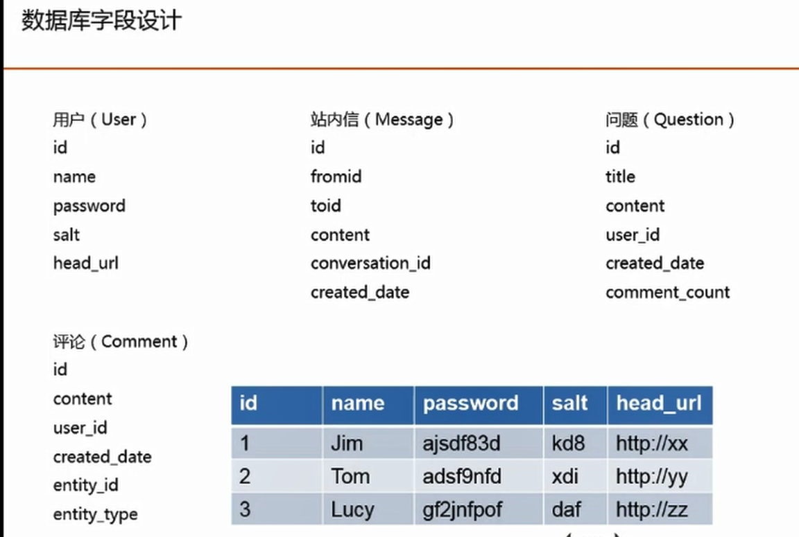

# 创建项目

关联github

1. file里添加github账号
2. 创建远程仓库
3. 创建本地仓库并提交
4. alt f12   git pull origin master --allow-unrelated-histories   把readme拉下来  或者 git pull --rebase origin master 
5. push


# 数据库  首页展示

mysql  +  druid  + mybatis




写建表sql

druid数据源    

IDEA自动生成实体类

集合mybatis（配置 编写DAO层）


写service  control    修改thymeleaf模板


# 登录注册

webjars  引入jquery等

首先是基本的注册登录功能

注册前端验证合法性 ajax验证用户名是否重复等

然后登录注册同理  成功之后 生成一个token（JWT）  用cookie的方式进行存储

注意：chrome对setMaxAge（-1）的cookie还是会保存 因此设置1s

然后用一个threadlocal保存所有用户登录信息，方便多线程使用


然后就是拦截器功能

第一个拦截器读取cookie并验证  如果有用户信息就存储

在视图渲染前 存储用户信息方便视图读取 注意这里还要判断modelAndView是否为null  因为有的responsebody的控制器是不返回视图的

最后渲染结束进行清空

第二个拦截器对需要登录的页面验证是否有用户信息  如果没登录 保存要访问的地址 返回登录页面  登录后 如果要返回的地址不为空 再继续访问


然后就是前端页面 要存储这个继续访问地址   并且根据是否有user进行展示


最后登出功能  要删除cookie 并删除存储的用户信息


# 发布问题

**提问发布问题**    控制器添加问题并返回json字符串

service中添加去除html标签等简单防止xss的代码  

**敏感词过滤**

构造敏感词的前缀树 三个指针分别标记前缀树当前位置  当前词起始  当前匹配位置   进行敏感词替换

构造敏感词过滤service   实现 InitializingBean接口重写afterPropertiesSet方法进行初始化

```
初始化顺序

BeanPostProcessor，针对所有Spring上下文中所有的bean

最先执行的是postProcessBeforeInitialization，然后是afterPropertiesSet，然后是init-method，然后是postProcessAfterInitialization。
```

**展示问题细节**

## 多线程

Executor

运行任务的框架，将任务和运行任务解耦

指定数量的线程池  并可以提交任务   查看任务执行状态

Future 等待任务执行完成 获得返回结果

主要用于线程通信  如异步获取线程返回结果 阻塞等待返回结果  设置线程超时时间   获取线程抛出的异常


# 评论功能

添加评论功能  并且增加评论的实体类型和实体id  方便不同模块通用评论功能（问题下增加一条评论  增加评论同时问题的评论数+1应该是一个事务）


# 私信功能

向某个用户发送私信   

页面展示某个会话的所有私信    

展示和所有人的会话信息（时间最新的在前面）


# Redis

实现赞踩功能

## 异步队列


定义事件类型  事件模型

事件producer（生产者） 接收事件  通过 json序列化事件  并存储进缓存列表

定义handler接口统一处理事件

事件consumer（消费者）初始化上下文信息 记录每个eventType 对应的handler链   并开启线程池分发事件队列里的事件

具体的handler处理具体的事件

然后需要的时候只需要用producer发送事件即可

## 邮件发送


# 关注服务

使用zset（方便存储关注时间） 存储某个实体的关注列表和粉丝列表

编写service对应的方法  编写controller 如关注 就是调用service的关注  发送异步事件  发送改变信息用于回显

关注人：

每个人有profile 显示自己的详情

关注问题

修改相应的class  使用js修改关注后的页面数据


# 排序

使用不同算法计算权重值   选出首页前面的问题


# Tineline

开发
1. EventHandler
2. FeedDAO/Service/Model
3. Redis队列存储

优化
1. 多好友合并去重
2. 关联实体删除清理
3. 取消/新增关注实时更新
4. 分时段存储
5. 缓存和增量拉


新鲜事 （类似好友动态）

推模式下  每个用户的新鲜事用有序集合维持  方便求交集  时间排序等

关注或取关用户   添加或删除关联的新鲜事


# 爬取

使用pyspider爬取v2ex 产生问题的数据


# 全文搜索

启动solr

配置中文分词器 ikanalyzer 添加jar包

D:\software\solr-8.5.0\solr-8.5.0\server\solr-webapp\webapp\WEB-INF\lib

建立两个字段的索引 title content

那么添加一个document的时候会分别建立这两个索引（分词创建key）

查询也是根据分词的key进行查找相应字段索引


导入mysql数据

cnblogs.com/david1216/p/11479495.html


添加相应web功能

查找索引出的问题并展示

添加问题时通过异步事件添加索引


# 面试

1.开发工具Git，IntilliJ
2.Spring Boot，Velocity
3.myBatis
4.登陆/注册
5.前缀树
6.Redis
7.异步框架
8.邮件，排序算法
9.推拉timeline
10.爬虫
11.solr搜索
12.单元测试/部署

